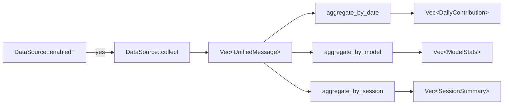

# core-engine

## 0. 术语约定

| 术语 | 定义 | 防冲突 |
|---|---|---|
| `UnifiedMessage` | 一次 AI 请求的归一化记录，含 client/model/tokens/cost 等字段 | 全新项目，无冲突 |
| `TokenBreakdown` | 归一化 token 拆解：input / output / cache_read / cache_write / reasoning | grep 无命中 |
| `DataSource` | 数据源 trait，定义 `enabled()` + `collect()` | 全新 |
| `cache_read` | 从缓存读取的 input token 数（Anthropic 语义），OpenAI 协议从 `cached_tokens` 中分离 | 全新 |
| `cache_write` | 本次请求新写入缓存的 token 数，下次可被 cache_read 命中 | 全新 |
| `缓存命中率` | `cache_read / (input + cache_read)`，由 core-engine 提供计算函数 | 全新 |

## 1. 决策与约束

### 需求摘要

- **做什么**：定义 UsageMonitor 所有模块共享的核心数据模型、数据源抽象、协议归一化工具、文件扫描框架、聚合逻辑。纯库，零运行时依赖外部服务。
- **为谁**：下游模块（parsers、cc-switch-adapter、storage、pricing、web-dashboard、tui、cli）都依赖它。
- **成功标准**：下游模块 import 后不需要重新定义 token 结构 / 数据源接口 / 聚合逻辑，直接调用。
- **明确不做**：
  - 不包含任何具体工具的 parser 实现（parsers 负责）
  - 不定义 SQL 或 HTTP 接口（storage / web-dashboard 负责）
  - 不做定价计算（pricing 负责）
  - 不引入第三方 API 调用

### 复杂度档位

全新项目，走**零起点**默认档位，无偏离。

### 关键决策

1. **归一化以 Anthropic 语义为基准**——`cache_read` 和 `cache_write` 独立于 `input` 存在。OpenAI 协议的 `cached_tokens` 含在 `input` 内的，由 parser 负责做减法分离。理由：Anthropic 的 cache 模型更细粒度，以它为基准不会丢信息；反过来以 OpenAI 为基准会把 cache 信息合并掉。
2. **`DataSource` trait 而非抽象类**——Rust trait 允许下游自由实现，不做继承约束。`enabled()` 和 `collect()` 是两个方法，简单够用。
3. **扫描框架用 `walkdir` + 模式匹配**——参考 Tokscale scanner.rs，不自己实现目录遍历。每个数据源注册时声明路径 + glob 模式。
4. **聚合层用累加器模式**——不引入 SQL/外部依赖，纯内存 Map-Reduce 式聚合。输入 `Vec<UnifiedMessage>`，输出按维度分组的统计结构。
5. **语言选 Rust**——单二进制分发，axum/ratatui 生态成熟，Tokscale 同语言可参考架构思路但不复制代码。

### 前置依赖

无。全新项目，core-engine 是第一个模块。

## 2. 名词与编排

### 2.1 名词层

#### TokenBreakdown

**现状**：无现状，全新。

**变化**：新增 `TokenBreakdown` 结构体——全系统统一的 token 拆解单位。

```rust
/// 归一化 token 拆解。
/// 以 Anthropic 协议的 cache 语义为基准。
#[derive(Debug, Clone, Default, PartialEq, Eq, Serialize, Deserialize)]
pub struct TokenBreakdown {
    pub input: i64,
    pub output: i64,
    /// 从缓存读取、未产生新费用的 input token。
    /// Anthropic: 直接取自 `cache_read_input_tokens`
    /// OpenAI: 如果 `cached_tokens` 含在 `prompt_tokens` 内，parser 必须从 input 扣除后填入
    pub cache_read: i64,
    /// 本次写入缓存、下次可被 cache_read 命中的 token。
    /// Anthropic: 取自 `cache_creation_input_tokens`
    pub cache_write: i64,
    /// 推理 token（如 o1/r1 的 thinking），无则 0。
    pub reasoning: i64,
}
```

**TokenBreakdown 方法**：
```rust
impl TokenBreakdown {
    /// 总 token = input + output + cache_write + reasoning
    /// 注意 cache_read 不计入（它是"省掉"的 token，不是"消耗"的 token）
    pub fn total_tokens(&self) -> i64;

    /// 缓存命中率 = cache_read / (input + cache_read)
    /// 返回 0.0 ~ 1.0，分母为 0 返回 0.0
    pub fn cache_hit_rate(&self) -> f64;

    /// 所有字段取 max(0)，防止负数
    pub fn clamp_negative(&mut self);
}
```

#### UnifiedMessage

**现状**：无现状，全新。

**变化**：新增 `UnifiedMessage`——一次 AI 请求的归一化记录。这是全系统的"通用货币"，parsers 产出它、aggregator 消费它、storage 持久化它。

```rust
#[derive(Debug, Clone, PartialEq, Serialize, Deserialize)]
pub struct UnifiedMessage {
    /// 工具标识："claude" | "codex" | "kimi" | "gemini" | "pi" | "openclaw" | "hermes"
    pub client: String,
    /// 模型标识："deepseek-v4-pro" | "kimi-for-coding" | "gpt-5.4" | ...
    pub model_id: String,
    /// 供应商标识："anthropic" | "openai" | "moonshot" | "google" | ...
    pub provider_id: String,
    /// session UUID（各工具自行定义）
    pub session_id: String,
    /// Unix 毫秒时间戳
    pub timestamp: i64,
    /// 归一化 token 拆解
    pub tokens: TokenBreakdown,
    /// USD 花费，0 表示免费或未定价
    pub cost: f64,
    /// 请求去重键（parser 填，用于 streaming 去重）
    pub request_id: Option<String>,
    /// 工作目录
    pub workspace: Option<String>,
    /// 数据来源："cc-switch" | "native"
    pub data_source: String,
}
```

#### DataSource trait

**现状**：无现状，全新。

**变化**：新增 `DataSource` trait——所有数据源（CC Switch adapter、各工具 parser scanner）的统一抽象。

```rust
pub trait DataSource {
    /// 数据源名称，用于标识和去重
    fn name(&self) -> &str;

    /// 轻量检查：该数据源是否可用（文件/DB 是否存在）
    /// 不做解析，只做 stat/open 级别检查
    fn enabled(&self) -> bool;

    /// 采集数据，返回 UnifiedMessage 流
    /// 返回空 Vec 表示无新数据，不是错误
    fn collect(&self) -> Result<Vec<UnifiedMessage>, DataSourceError>;
}

#[derive(Debug, thiserror::Error)]
pub enum DataSourceError {
    #[error("数据源不可用: {0}")]
    NotAvailable(String),
    #[error("解析错误: {0}")]
    ParseError(String),
    #[error("IO 错误: {0}")]
    IoError(String),
}
```

#### Scanner（文件扫描框架）

**现状**：无现状，全新。

**变化**：提供文件发现能力——给定根目录 + 文件模式，返回匹配的文件列表。参考 Tokscale 的 `scan_directory()` 但简化：只做文件发现，不绑定具体 parser。

```rust
/// 扫描配置：根目录 + 文件模式 + 排除模式
pub struct ScanTask {
    pub root: PathBuf,
    /// glob 模式，如 "*.jsonl"、"*.json|*.jsonl"
    pub pattern: String,
    /// 可选的排除模式
    pub exclude: Option<String>,
}

/// 扫描单个任务，返回匹配的文件路径列表（已排序 + 去重）
pub fn scan_directory(task: &ScanTask) -> Result<Vec<PathBuf>, ScannerError>;

/// 并行扫描多个任务
pub fn scan_all(tasks: &[ScanTask]) -> Result<Vec<PathBuf>, ScannerError>;
```

#### 聚合类型

**现状**：无现状，全新。

**变化**：新增聚合输出类型——`DailyContribution`、`ModelStats`、`SessionSummary`。

```rust
/// 按日聚合的用量
pub struct DailyContribution {
    pub date: String,           // "YYYY-MM-DD"
    pub tokens: TokenBreakdown,
    pub cost: f64,
    pub request_count: usize,
    /// 按 model_id 分组的 TokenBreakdown
    pub by_model: HashMap<String, TokenBreakdown>,
}

/// 按模型聚合的统计
pub struct ModelStats {
    pub model_id: String,
    pub provider_id: String,
    pub tokens: TokenBreakdown,
    pub cost: f64,
    pub request_count: usize,
    pub session_count: usize,
    /// 出现过的 client 列表
    pub clients: Vec<String>,
}

/// 按 session 聚合的摘要
pub struct SessionSummary {
    pub session_id: String,
    pub client: String,
    pub model_id: String,
    pub tokens: TokenBreakdown,
    pub cost: f64,
    pub message_count: usize,
    pub first_seen: i64,
    pub last_seen: i64,
}
```

#### 协议归一化工具

```rust
/// 修正 OpenAI 协议的 cache-inclusive input：从 input 中扣除 cached 部分
/// input=1000, cached=200 → 返回 (input=800, cache_read=200)
/// 如果 cached >= input，则 cache_read = input, input = 0
pub fn subtract_cached_overlap(input: i64, cached: i64) -> (i64, i64);

/// 计算缓存命中率
/// cache_read / (input + cache_read)，分母 0 返回 0.0
pub fn cache_hit_rate(cache_read: i64, input: i64) -> f64;

/// 归一化模型名：去日期后缀、去点划线变体、小写化
/// "gpt-5.3-2025-08-01" → "gpt-5.3"
pub fn normalize_model_id(raw: &str) -> String;
```

### 2.2 编排层

#### 主流程图



#### 现状

无现状，全新项目。

#### 变化

新增三条聚合流水线，每条都是纯函数：`Vec<UnifiedMessage>` → 聚合结果。

1. **按日聚合**：按 `timestamp → date` 分组，累加 TokenBreakdown + cost，统计 request_count
2. **按模型聚合**：按 `(provider_id, model_id)` 分组，额外统计 session_count 和出现过的 clients
3. **按 session 聚合**：按 `session_id` 分组，额外统计 message_count 和时间范围

#### 流程级约束

- **全正约束**：聚合输出各字段通过 `max(0, value)` 防负值
- **幂等性**：输入相同的 `Vec<UnifiedMessage>` 两次，输出完全一致
- **空输入容忍**：空 Vec 返回空聚合结果，不报错
- **跨日边界**：`timestamp` → `date` 转换使用**本地时区**（用户看到的"今天"应该是本地时间）

### 2.3 挂载点清单

- `Cargo.toml`：新增 `usage-monitor-core` crate 声明 — 新增
- `crates/usage-monitor-core/src/lib.rs`：模块入口 — 新增

本 feature 引入 2 个挂入点。其余类型/函数均为内部实现，删掉即 feature 消失。

### 2.4 推进策略

按"类型定义 → 归一化工具 → 扫描框架 → 聚合逻辑"切片：

1. **TokenBreakdown + UnifiedMessage**：定义两个核心结构体及其方法（total_tokens、cache_hit_rate、clamp_negative）
   - 退出信号：单元测试覆盖 `total_tokens()` 不重复计入 cache_read、`cache_hit_rate()` 计算正确、`clamp_negative()` 修正所有负字段
2. **DataSource trait + DataSourceError**：定义 trait 和错误枚举
   - 退出信号：可编译通过，下游 crate 能 `use` 并实现该 trait
3. **协议归一化工具**：`subtract_cached_overlap()`、`cache_hit_rate()`、`normalize_model_id()`
   - 退出信号：单元测试覆盖 OpenAI cache-inclusive 场景、边界（cached >= input）、空模型名
4. **Scanner 框架**：`ScanTask` + `scan_directory()` + `scan_all()`
   - 退出信号：单元测试覆盖单文件匹配、多模式、排除模式、空目录
5. **聚合逻辑**：`aggregate_by_date()`、`aggregate_by_model()`、`aggregate_by_session()`
   - 退出信号：单元测试覆盖空输入、单条、多条同日、跨日、多模型、多 session
6. **校验与收尾**：`clippy` + `cargo test` 全绿，`cargo doc` 无警告
   - 退出信号：所有测试通过，文档自动生成

### 2.5 结构健康度与微重构

##### 评估

- 文件级：全新项目，无现有文件
- 目录级：全新项目，目标目录为 `crates/usage-monitor-core/src/`，首轮仅 `lib.rs` + 若干子模块（不超过 6 个）

##### 结论：不做

全新项目，无存量代码债。首轮文件数少，不触发目录摊平。

## 3. 验收契约

### 关键场景清单

| # | 场景 | 输入 / 触发 | 期望结果 |
|---|---|---|---|
| S1 | TokenBreakdown total 不计入 cache_read | `{input:1000, output:500, cache_read:200, cache_write:100, reasoning:0}` | `total_tokens() == 1600`（1000+500+100+0） |
| S2 | 缓存命中率正常计算 | `cache_read=200, input=800` | `cache_hit_rate() ≈ 0.2` |
| S3 | 分母为 0 时缓存命中率 | `cache_read=0, input=0` | `cache_hit_rate() == 0.0` |
| S4 | clamp_negative 修正所有负字段 | `{input:-1, output:-2, cache_read:-3, cache_write:-4, reasoning:-5}` | 全部字段 ≥ 0 |
| S5 | subtract_cached_overlap 正常分离 | `input=1000, cached=200` | `(input=800, cache_read=200)` |
| S6 | cached >= input 边界 | `input=100, cached=200` | `(input=0, cache_read=100)` |
| S7 | normalize_model_id 去日期后缀 | `"gpt-5.3-2025-08-01"` | `"gpt-5.3"` |
| S8 | scan_directory 单模式匹配 | 根目录含 `a.jsonl` `b.txt`，pattern `"*.jsonl"` | 返回 `[a.jsonl]` |
| S9 | scan_all 多任务并行 | 两个 ScanTask，各含不同目录和模式 | 返回两目录匹配文件的并集（去重） |
| S10 | aggregate_by_date 同日累加 | 两条 UnifiedMessage 同日期不同时间 | 输出 1 条 DailyContribution，tokens 为两条之和 |
| S11 | aggregate_by_date 跨日拆分 | 两条 UnifiedMessage 不同日期 | 输出 2 条，各带对应日期 |
| S12 | aggregate_by_model 分组正确 | 同模型不同 session 的 3 条消息 | 输出 1 条 ModelStats，session_count=2 |
| S13 | aggregate_by_session 分组正确 | 2 个 session 各 2 条消息 | 输出 2 条 SessionSummary，各 message_count=2 |
| S14 | 空输入容忍 | 空 Vec 输入任一聚合函数 | 返回空结果，不 panic |
| S15 | 负值输入聚合 | message 含负 token（已 clamp 为 0） | 输出全字段 ≥ 0 |

### 明确不做的反向核对项

- 代码中不应出现对任何 AI API 的 HTTP 调用
- 代码中不应出现 SQL 语句或数据库连接
- 代码中不应出现定价相关逻辑（`cost` 字段存在但由外部填入）
- 不应依赖 `tokio`（纯同步库，async 留给上游模块）

## 4. 与项目级架构文档的关系

**提炼回 architecture 的内容**（acceptance 后由 cs-arch backfill 执行）：

- **名词**：`TokenBreakdown`、`UnifiedMessage`、`DataSource trait` 是系统级可见的类型，应写入 architecture 的"数据与状态"节
- **动词骨架**：Scanner → DataSource → Aggregator 三层流水线应写入 architecture 的结构图
- **流程级约束**：全正约束、幂等性、空输入容忍、本地时区规则应写入 architecture 的"已知约束"

**关联已有架构 doc**：无。项目目前仅 `ARCHITECTURE.md` 骨架，本次不更新（由 acceptance 统一回写）。
