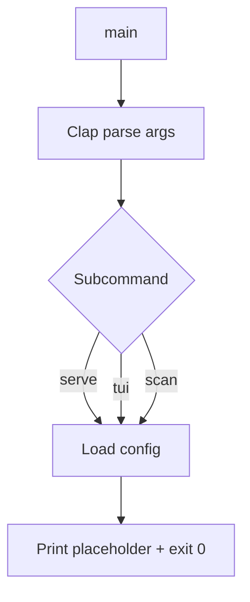

# cli-entry

## 0. 术语约定

| 术语 | 定义 | 防冲突 |
|---|---|---|
| `serve` | 启动 Web 仪表盘 HTTP 服务 | 全新 |
| `tui` | 启动终端交互界面 | 全新 |
| `scan` | 手动触发一次数据扫描 | 全新 |
| `config` | 可选的 TOML 配置文件 `~/.usage-monitor/config.toml` | 全新 |

## 1. 决策与约束

### 需求摘要

- **做什么**：提供一个 CLI 二进制 `usage-monitor`（或 `um`），支持 `serve` / `tui` / `scan` 三个子命令。加载可选配置文件。每个子命令当前打印占位信息即可（实际逻辑由后续 feature 注入）。
- **为谁**：终端用户，所有后续 feature 的入口。
- **成功标准**：`cargo run -- --help` 输出帮助信息；`cargo run -- scan` 打印 "scanning..." 占位。
- **明确不做**：
  - 不实现 serve/tui/scan 的实际逻辑（各自 feature 负责）
  - 不做配置校验（校验归各 feature）
  - 不做守护进程 / 后台模式

### 复杂度档位

走默认档位，无偏离。这是一个简单的 CLI 壳子。

### 关键决策

1. **用 `clap` derive 模式**——Rust 生态标准，声明式，自带 help 生成。
2. **配置文件可选**——不强制，不存在配置时走默认值。格式用 TOML（Rust 生态惯例）。
3. **二进制名 `usage-monitor`**，放在 workspace root `src/main.rs`（workspace 默认二进制）。后续功能代码注入为库依赖。
4. **每个子命令只做初始化 + 打印占位 + 返回 Ok**——实际逻辑由后续 feature 挂入。

### 前置依赖

无。但 workspace 已有 `usage-monitor-core` crate（core-engine），本 feature 将它作为依赖引入（暂不调用，仅供将来 Serve/Tui/Scan 命令使用）。

## 2. 名词与编排

### 2.1 名词层

#### CLI 结构

**现状**：workspace 有 `src/main.rs`（cargo init 自动生成的 hello world），无实际 CLI。

**变化**：用 clap derive 替换为子命令结构。

```rust
/// UsageMonitor — AI coding tool token usage tracker.
#[derive(Parser)]
#[command(name = "usage-monitor", version, about)]
struct Cli {
    #[command(subcommand)]
    command: Command,
}

#[derive(Subcommand)]
enum Command {
    /// Start the web dashboard
    Serve {
        #[arg(short, long, default_value = "4317")]
        port: u16,
    },
    /// Start the terminal UI
    Tui,
    /// Trigger a manual scan of all data sources
    Scan,
}
```

**退出信号**：`usage-monitor --help` 输出三个子命令及描述。

#### 配置结构

**现状**：无。

**变化**：定义 `Config` 结构体，从 `~/.usage-monitor/config.toml` 反序列化。

```rust
#[derive(Debug, Default, Deserialize)]
pub struct Config {
    /// Web dashboard port
    pub port: Option<u16>,
    /// Data sources to enable (empty = auto-detect all)
    pub data_sources: Option<Vec<String>>,
    /// CC Switch database path override
    pub cc_switch_db: Option<String>,
}
```

加载逻辑：文件不存在 → `Config::default()`。文件存在但格式错误 → 打印 warning，用默认值。

### 2.2 编排层

#### 主流程图



#### 现状

无现状（之前 `src/main.rs` 仅 hello world）。

#### 变化

1. 在 `src/main.rs` 中用 clap derive 定义 CLI
2. 实现 `load_config()` —— 读 `~/.usage-monitor/config.toml`，失败用默认
3. 每个子命令 handler 打印占位信息
4. `Cargo.toml` 加 `clap`、`toml`、`serde` 依赖 + 引用 `usage-monitor-core`

#### 流程级约束

- 配置不存在不报错，静默用默认值
- 配置格式错误打印 warning 到 stderr，不阻止启动
- 所有子命令返回 `ExitCode` 或 `anyhow::Result`

### 2.3 挂载点清单

- `Cargo.toml`：新增 `clap` / `toml` / `serde` 依赖 — 修改
- `src/main.rs`：CLI 入口 — 新增（替换 hello world）
- `~/.usage-monitor/config.toml`：配置文件路径约定 — 新增

### 2.4 推进策略

1. **Cargo 配置**：在 workspace root `Cargo.toml` 加依赖 + 引用 `usage-monitor-core`
   - 退出信号：`cargo check` 通过
2. **CLI 结构**：实现 `Cli` + `Command` enum + 三个 handler 占位
   - 退出信号：`cargo run -- --help` 输出正确；`cargo run -- serve|tui|scan` 各打印占位
3. **配置加载**：实现 `Config` struct + `load_config()`
   - 退出信号：无配置时静默默认；错误配置打印 warning；正确配置反序列化成功
4. **校验收尾**：`clippy` + `cargo test` + `cargo run` 验证

### 2.5 结构健康度与微重构

##### 评估

- 文件级：`src/main.rs` 当前仅 hello world（3 行），替换为新文件，无存量问题
- 目录级：`src/` 仅 1 个文件，不触发摊平

##### 结论：不做

全新文件，无存量负担。

## 3. 验收契约

### 关键场景清单

| # | 场景 | 输入 / 触发 | 期望结果 |
|---|---|---|---|
| S1 | 帮助信息 | `usage-monitor --help` | 输出三个子命令（serve/tui/scan）及描述 |
| S2 | 版本信息 | `usage-monitor --version` | 输出版本号 |
| S3 | serve 占位 | `usage-monitor serve` | stdout 输出 "Starting web dashboard on port 4317..."（占位），exit 0 |
| S4 | serve 自定义端口 | `usage-monitor serve --port 3000` | stdout 含 "port 3000" |
| S5 | tui 占位 | `usage-monitor tui` | stdout 输出 "Starting TUI..."（占位），exit 0 |
| S6 | scan 占位 | `usage-monitor scan` | stdout 输出 "Scanning..."（占位），exit 0 |
| S7 | 无配置文件 | 不存在 `~/.usage-monitor/config.toml` | 静默使用默认配置，不报错 |
| S8 | 错误配置文件 | config.toml 格式错误 | stderr 打印 warning，使用默认值，不阻止启动 |
| S9 | 正确配置文件 | config.toml 含 `port = 3000` | `Config { port: Some(3000), .. }` 正确反序列化 |

### 明确不做的反向核对项

- 代码中不应出现 HTTP 服务启动逻辑（归 web-dashboard）
- 代码中不应出现 TUI 渲染逻辑（归 tui）
- 代码中不应出现文件扫描逻辑（归 parsers / cc-switch-adapter）

## 4. 与项目级架构文档的关系

**提炼回 architecture 的内容**（acceptance 后执行）：

- **名词**：CLI 入口（二进制名 `usage-monitor`）、配置文件路径约定写入架构总入口
- **动词骨架**：启动流（parse → load config → dispatch）写入架构

**关联已有架构 doc**：`ARCHITECTURE.md` 第 3 节模块索引目前列出了 `cli` 模块但标注"待实现"，本 feature 完成后更新为"已实现"。
