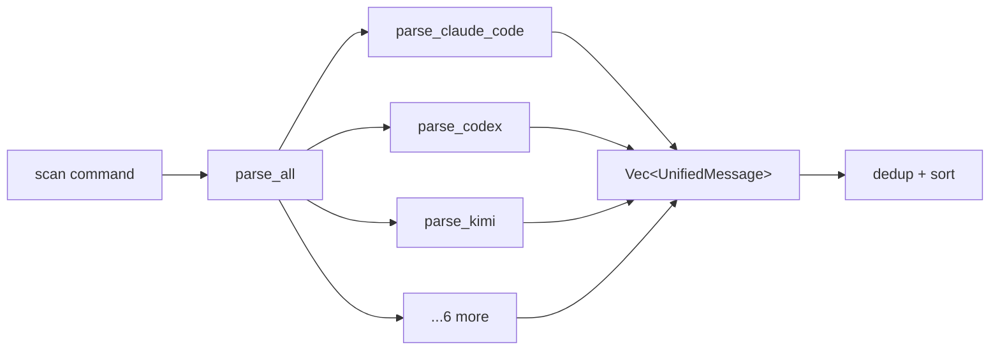

# parsers-native

## 0. 术语约定

| 术语 | 定义 | 防冲突 |
|---|---|---|
| `parser` | 单个工具的 session 文件 → `Vec<UnifiedMessage>` 的转换器 | 全新 |
| `usage-monitor-parsers` | 新 crate，容纳所有 parser | 全新 |
| `wire.jsonl` | Kimi Code 的 session 日志格式 | 参考 Tokscale kimi.rs |
| `sessions.json` | OpenClaw 的 session 索引文件 | 参考 Tokscale openclaw.rs |

## 1. 决策与约束

### 需求摘要

- **做什么**：创建 `usage-monitor-parsers` crate，包含 7 个工具的 session 文件解析器。每个 parser 输入文件路径，输出 `Vec<UnifiedMessage>`。处理 streaming 去重、增量 delta 计算、cache-inclusive 修正等边界条件。
- **为谁**：Scanner（文件发现后路由到此）+ CLI scan 命令 + Web API scan 端点。
- **成功标准**：对有真实 session 文件的 Claude Code 用户，`usage-monitor scan` 能输出非空的 token 统计。
- **明确不做**：
  - 不做文件发现（scanner 框架已在 core-engine 中，路由逻辑在 scanner 调用方）
  - 不做数据存储（storage-layer 负责）
  - 不做定价计算（pricing-engine 负责）

### 复杂度档位

走默认档位。7 个 parser 虽然多，但结构相同——每个是一个独立模块，不互相依赖。

### 关键决策

1. **新 crate `usage-monitor-parsers`**——干净隔离，core-engine 不依赖它，它依赖 core-engine
2. **统一的 parser 签名**：每个 parser 暴露 `pub fn parse_xxx_dir(base: &Path) -> Result<Vec<UnifiedMessage>, ParserError>`
3. **最小闭环先行**：Claude Code parser 第一个实现并验证，其余 6 个后续补齐
4. **参考 Tokscale sessions/ 的处理方式**但不复制代码（MIT 协议，参考架构思路）
5. **每个 parser 处理自己的容错**：malformed line 静默跳过 + 返回已解析的部分；文件不存在返回空

### 前置依赖

`core-engine`（done ✓）——需要 `UnifiedMessage`、`TokenBreakdown`、`subtract_cached_overlap()`、`normalize_model_id()`

## 2. 名词与编排

### 2.1 名词层

#### ParserError

**现状**：core-engine 无 parser 专用错误类型。

**变化**：新增统一错误枚举。

```rust
#[derive(Debug, thiserror::Error)]
pub enum ParserError {
    #[error("I/O error: {0}")]
    Io(#[from] std::io::Error),
    #[error("JSON parse error in {file}: {message}")]
    Json { file: PathBuf, message: String },
}
```

#### 各 parser 模块

新增 crate `crates/usage-monitor-parsers/`，目录结构：

```
crates/usage-monitor-parsers/src/
├── lib.rs           # pub mod 声明 + re-export + parse_all()
├── claude_code.rs   # Claude Code JSONL
├── codex.rs         # Codex CLI JSONL
├── kimi.rs          # Kimi wire.jsonl
├── gemini.rs        # Gemini session JSON/JSONL
├── pi.rs            # Pi session JSONL
├── openclaw.rs      # OpenClaw JSONL + sessions.json 索引
└── hermes.rs        # Hermes SQLite
```

#### 统一 public 函数签名

每个 parser 暴露：

```rust
/// Parse {tool} session files under `base_dir`, return UnifiedMessage stream.
pub fn parse_{tool}(base_dir: &Path) -> Result<Vec<UnifiedMessage>, ParserError>;
```

此外 `lib.rs` 提供：

```rust
/// Run all available parsers, return combined results.
pub fn parse_all(base_dirs: &HashMap<ClientId, PathBuf>) -> Result<Vec<UnifiedMessage>, ParserError>;
```

### 2.2 编排层

#### 主流程图



#### 现状

无现状，全新 crate。

#### 变化

1. 新增 `usage-monitor-parsers` crate
2. 每个 parser 独立模块，纯函数
3. `parse_all()` 聚合所有 parser 结果，去重

#### 流程级约束

- 每个 parser 互不依赖，一个失败不影响其他
- 去重基于 `(client, request_id, timestamp)` 三元组
- malformed line 跳过但不中断整个文件

### 2.3 挂载点清单

- `crates/usage-monitor-parsers/Cargo.toml`：新增 crate — 新增
- `crates/usage-monitor-parsers/src/lib.rs`：模块入口 — 新增
- `Cargo.toml` workspace members：注册新 crate — 修改

### 2.4 推进策略

按"一个 parser → 框架 → 全部"节奏：

1. **Cargo 搭建**：创建 `usage-monitor-parsers` crate + workspace 注册 + 依赖 core-engine
   - 退出信号：`cargo check` 通过
2. **Claude Code parser**（最小闭环先行）：实现 `parse_claude_code()`
   - 退出信号：针对真实 Claude Code session JSONL 文件能解析出 UnifiedMessage
3. **Codex parser**：实现 `parse_codex()`
   - 退出信号：同 Claude Code
4. **其余 5 个 parser**（Kimi / Gemini / Pi / OpenClaw / Hermess）：逐个实现
   - 退出信号：每个至少通过单元测试（虚构合法输入）
5. **`parse_all()` 聚合**：实现全 parser 调度 + 去重
   - 退出信号：parse_all() 返回合并去重结果
6. **挂接到 CLI**：`usage-monitor scan` 调用 `parse_all()`
   - 退出信号：`cargo run -- scan` 输出实际解析结果数
7. **校验收尾**：clippy + test + cargo doc

### 2.5 结构健康度与微重构

##### 评估

- 文件级：全新 crate，无存量
- 目录级：新目录 `crates/usage-monitor-parsers/src/`，预计 8 文件（lib + 7 parser），不触发摊平

##### 结论：不做

全新代码，无存量负担。

## 3. 验收契约

### 关键场景清单

| # | 场景 | 输入 / 触发 | 期望结果 |
|---|---|---|---|
| S1 | Claude Code JSONL 正常解析 | 含 `entry_type: "assistant"` + `usage` 的 JSONL | 返回 UnifiedMessage，tokens 非零 |
| S2 | Claude Code streaming 去重 | 同 messageId 出现 2 次（token 递进） | 取各字段 max 值，只返回 1 条 |
| S3 | Claude Code user entry 过滤 | JSONL 含 `entry_type: "user"` | 不产生 UnifiedMessage |
| S4 | Codex token_count 正常解析 | 含 `type: "token_count"` 的 JSONL | 返回 UnifiedMessage，delta 正确 |
| S5 | Kimi StatusUpdate 正常解析 | 含 `msg_type: "StatusUpdate"` 的 wire.jsonl | 返回 UnifiedMessage |
| S6 | Gemini session JSON 正常解析 | `type: "gemini"` + usage 的 session JSON | 返回 UnifiedMessage |
| S7 | Pi assistant message 正常解析 | `role: "assistant"` + usage 的 session JSONL | 返回 UnifiedMessage |
| S8 | OpenClaw message 正常解析 | `role: "assistant"` + usage 的 JSONL | 返回 UnifiedMessage |
| S9 | Hermes SQLite 正常解析 | 含 sessions 表的 SQLite DB | 返回 UnifiedMessage |
| S10 | 空目录 / 无文件 | parser 传入不存在的目录 | 返回空 Vec，不报错 |
| S11 | malformed JSON 行 | JSONL 中含非法行 | 跳过该行，其余正常解析 |
| S12 | `parse_all()` 去重 | 两个 parser 返回相同记录 | 去重后只保留 1 条 |
| S13 | CLI 挂接 | `usage-monitor scan` | 输出解析到的消息数 |

### 明确不做的反向核对项

- 不做文件发现（parser 接收已有路径列表）
- 不做数据持久化
- 不做 CC Switch 数据源（那是 cc-switch-adapter）

## 4. 与项目级架构文档的关系

**提炼回 architecture 的内容**：`parsers` 模块标注从"待实现"→"已实现"；各 parser 支持的格式写入架构 doc。
